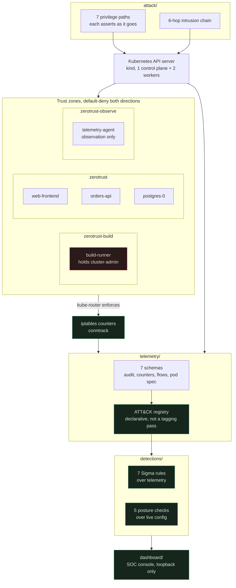
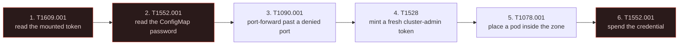

<div align="center">

# ZeroTrust-SOC-Lab

**A Kubernetes attack-to-detection lab that runs entirely on your laptop.**

Break in for real. Watch it get recorded. Find out whether anything noticed.

[](LICENSE)
[](https://attack.mitre.org/)
[](https://kubernetes.io/)
[](https://www.python.org/)
[](https://learn.microsoft.com/powershell/)

</div>

---

## The question

> You have a Kubernetes cluster with network policies, workload identities and RBAC.
> An attacker gets in. **Do you notice, and can you prove what you noticed?**

Almost any cluster answers the first half. `kubectl get pods` will show a pod you did not
create. The second half is the hard one, and it is where security work quietly fails: a
dashboard showing a red number with no way back to the record that produced it.

So this lab is built backwards from the evidence. For every claim the console makes there is a
file you can open and a line in it you can check.

| Principle | What it means here |
|:--|:--|
| Nothing is simulated | Real `kind` cluster, real NetworkPolicies enforced by kube-router, real `kubectl` escalation, real audit-log and iptables-counter telemetry |
| Everything is ATT&CK-tagged | Every attack step, every telemetry rule and every detection carries its technique ID |
| Every gate can fail | Each rule is broken three ways on purpose and the build is required to notice |
| Gaps are stated, not hidden | What this *cannot* detect is documented in the same place as what it can |

---

## Architecture



---

## What's in the box

| Component | Count | What it does |
|:--|:--:|:--|
| Trust zones | 3 | `zerotrust`, `zerotrust-build`, `zerotrust-observe`, default-deny both directions |
| Workloads | 5 | each with a distinct service account and security context |
| Privilege paths | 7 | documented weaknesses, each walkable by script with per-step assertions |
| Attack chain | 6 hops | a full intrusion, end to end, each hop ATT&CK-mapped |
| Telemetry schemas | 7 | audit log, iptables counters, conntrack, pod spec |
| Sigma rules | 7 | real Sigma, validated by pySigma, each mutation-proven |
| Posture checks | 5 | configuration checks against live cluster state |
| Test suites | 7 | cluster-free, and every one is proven able to fail |
| Console | 6 pages | command centre, telemetry, rules, replay, topology, control |

---

## Quick start

**Prerequisites:** Docker Desktop (WSL2, 40 GB+ free), `kind`, `kubectl`, Python 3.11+.

```powershell
git clone https://github.com/dhanushbs10/zerotrust-soc-lab.git
cd zerotrust-soc-lab

powershell -File run-lab.ps1          # build, attack, collect, verify, detect
python dashboard\server.py            # then open http://127.0.0.1:8099
```

One command, about ten minutes. It generates secrets, builds the cluster, walks every
privilege path, runs the intrusion, collects the evidence, and proves the detections fire,
then prints a ledger of what ran and how long each stage took.

<details>
<summary><b>Useful flags</b></summary>

| Flag | Effect |
|:--|:--|
| `-SkipBootstrap` | cluster already running |
| `-SkipBootstrap -SkipAttack` | re-collect and re-verify only, which is the rule-editing loop |
| `-Recreate` | **Destructive.** Deletes the cluster and rebuilds from nothing |
| `-Serve` | leave the console up when the run finishes |

</details>

---

## The intrusion

Six hops, each one a real technique, each one detected.



| # | Technique | Step | Proof it worked, never printing the secret |
|:--|:--|:--|:--|
| 1 | `T1609.001` | read the mounted service-account token in-pod | token subject and length |
| 2 | `T1552.001` | read the ConfigMap copy of the DB password | fingerprint match |
| 3 | `T1090.001` | port-forward past a denied port | the relay never touches the policy chain |
| 4 | `T1528` | mint a *fresh* `cluster-admin` token rather than reuse one | proves theft, not reuse |
| 5 | `T1078.001` | use that authority to place a pod inside the zone | foothold running, labelled as a business workload |
| 6 | `T1552.001` | spend the stolen credential from the foothold | reads the `orders` table |

`detections/test-detections.py --chain` reports which hops have a rule behind them. It
currently reports **all six covered**, and states plainly that this means "a rule for that
technique exists and is matching", not "this hop caused those matches". Attributing by
technique alone would be the agreement-is-not-evidence mistake.

---

## The detection rules

| Rule | Technique | Fires on |
|:--|:--|:--|
| `det-0003` | `T1609.001` `T1550.001` | exec whose command is credential-shaped or shell-escaping |
| `det-0004` | `T1552.001` | pod log reads |
| `det-0005` | `T1046` | refused-packet bursts on a comparable counter delta |
| `det-0006` | `T1021` | cross-zone connections that are not the lab's own sensor |
| `det-0010` | `T1090.001` | `pods/portforward` |
| `det-0011` | `T1528` | token requests by a requester off the measured baseline |
| `det-0012` | `T1078.001` | pods created directly by a client identity |

Plus five posture checks, which are a genuinely different kind of question because they read
configuration rather than telemetry:

| Check | Asks |
|:--|:--|
| `DET-0001` | is a lab ServiceAccount bound to `cluster-admin`, or to any verb of `*` on `secrets`? |
| `DET-0002` | is a credential-shaped key or value sitting in a ConfigMap? |
| `DET-0007` | is a container's `runAsNonRoot` false or missing, `privileged`, or holding an off-allowlist capability? |
| `DET-0008` | is there a NetworkPolicy in the observe zone that grants ingress? |
| `DET-0009` | is a ServiceAccount issued a token while bound to nothing at all? |

---

## The part that makes this different

Most of this project is not the detection rules. It is making sure the rules are not lying.

### A gate that cannot fail is not a gate

Every rule is broken three ways on purpose, and the **same gate** is re-run:

| Mutation | What it removes | A rule that survives this is |
|:--|:--|:--|
| schema guard dropped | the `schema` predicate | matching on a coincidental field name |
| match-everything | all discrimination | a schema guard in disguise |
| impossible value | all matches | dead code that looks alive |

`SURVIVED` fails the build. The harness calls the real gate rather than a reimplementation of
it, because a harness that tests its own copy tests the copy.

### A rule that fires on your own testing looks like a working rule

When this was first built, a rule meant to catch cross-zone intrusions was firing on **the
lab's own health checks**. Four of four hits were instrumentation. It looked like a detection.
It was the lab congratulating itself.

So the collector labels the lab's own traffic (`source.role: instrumentation`) rather than
suppressing it, and the test suite states in `ALL_HITS_INSTRUMENTATION` that every one of
that rule's hits is instrumentation. A number nobody can distrust beats a number that looks
good.

### Counters are compared, never guessed

kube-router has no flow logs, so network detection is a **delta between two comparable reads**
of the same iptables chain. The collector distinguishes four states and refuses to compute a
delta in three of them, saying which one and why:

```
baselineState: chain-rebuilt
deltaValid:    false
deltaDenied:   null
deltaReason:   "the iptables chain was regenerated since the baseline, so its
                 counters restarted at zero and are not comparable"
```

A refused packet with no comparable baseline is not evidence of scanning. A collector that
reported the raw count would have made the rule fire, and it would have been lying about a
rate that never happened.

### Hit counts are a fingerprint, not a target

The audit log is cumulative and rotates, so every walk changes the numbers. An exact-count
gate could not pass twice in succession, so the gate rests on properties that do not depend
on the window: liveness, schema containment, strict subset, and no duplicate audit records.
Counts are reported as **drift**.

---

## What this does not do

Stated in the same place as what it does, because a lab that oversells itself teaches the
wrong lesson.

| Gap | Detail |
|:--|:--|
| `T1078.001` only partly covered | The rule catches pod creation by a client identity. It cannot separate an operator running `kubectl apply` from an attacker holding the same identity, and in this cluster that identity is both. |
| `T1021` has no attack-step positive | All of its hits are the lab's own sensor, by construction. The only cross-zone grants are the sensor's, so manufacturing a positive would mean adding a grant the lab does not need. |
| `T1190` not detected | It is in the catalogue; no collected schema carries it. |
| Network telemetry is counters, not flows | Destination and port are not available at the enforcement point. Events say so in a `resolution` field. |
| One failing assertion | One of the 54 privilege-path assertions currently fails and is undiagnosed. Listed here rather than hidden, which is the point. |

---

## Documentation

| Document | Contents |
|:--|:--|
| **[docs/HOW-IT-WORKS.md](docs/HOW-IT-WORKS.md)** | **Start here.** The reading guide: zones, credentials, the seven schemas, the registry, the gate, and what it all costs |
| **[docs/progress.md](docs/progress.md)** | Phase-by-phase status and the open decisions |
| **[docs/audit-2026-09-27.md](docs/audit-2026-09-27.md)** | A real audit of this codebase, including the bugs it found |
| **[AGENTS.md](AGENTS.md)** | The rules that are not obvious from the code |

<details>
<summary><b>Repository layout</b></summary>

```
run-lab.ps1     the whole lab in order, one command
cluster/        bootstrap and Kustomize base plus overlays
identities/     workload identity, RBAC, and the trust boundaries
workloads/      the five lab applications
attack/         privilege paths, the 6-hop chain, red-team scripts
telemetry/      collection, plus the ATT&CK registry
detections/     Sigma rules per technique, plus posture/ for live-config checks
graph/          reachability derivation, probe-verified
tools/          drift, image, pod and secret scanners, and the self-test gate
dashboard/      the SOC console
docs/           the reading guide, phase log, and audit record
```

</details>

---

## Safety

**Authorized lab use only.** The attack scripts target a local `kind` cluster named `soc-lab`
and take their target from the ambient kubeconfig. Point them at something you own.

- The cluster runs entirely in Docker on your machine. Nothing phones home.
- Credentials are generated at apply time into a gitignored `secrets/credentials.yaml`. Only
  `credentials.example.yaml` is tracked. A gitleaks pre-commit hook scans every commit, and
  the history has been verified to contain none of the three real generated secrets.
- The console binds **loopback only** and has no login. It can mint a `cluster-admin` token,
  which is deliberate: it is testing the same authority the chain steals. Do not bind it
  anywhere reachable.

---

## Contributing

Read [AGENTS.md](AGENTS.md) first. The rules that matter most:

1. **One logical change per commit**, Conventional Commits.
2. **Never commit secrets, kubeconfigs or cluster state.** `.telemetry/` is derived data.
3. **A new rule arrives with a test that proves it fires** and proves it is breakable.
4. **State the limitation.** Every rule's description says what it does not establish.

---

<div align="center">

MIT License. Built as a learning project on Kubernetes security and detection engineering.

</div>
